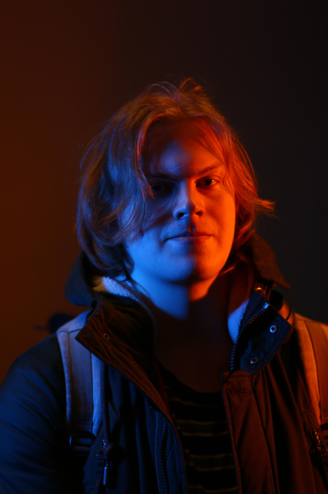

# Резюме: Сидорчук Максим Евгеньевич

    

## Контакты

tg: @tupatoster

Телефон: +79152153802

Почта: <tupatoster@gmail.com>

## Компетенции

- Умение работать со световыми пультами линейки grandma (в частности grand ma2 и grand ma3)
- Умение подключать и использовать различные световые приборы; умение составлять схемы питания, подключения и размещения
- Навыки постановки художественного света на театральные, танцевальные и музыкальные представления
  - Примеры:
    - Посвящения всех физтех-школ МФТИ за 2024 год (кроме ФПМИ и ФАКТ)
    - Гала концерт лауреатов студенческой весны в МФТИ
- Базовые знания работы с Resolume Arena
- Базовые знания работы с запись видео (настройка камер, роутинг видео, трансляции)
- Базыве навыки работы со звуком

## Опыт работы

Концертный зал МФТИ (2024-2025)

## Обновления резюме [здесь](https://github.com/TupaToster/art_cv)
